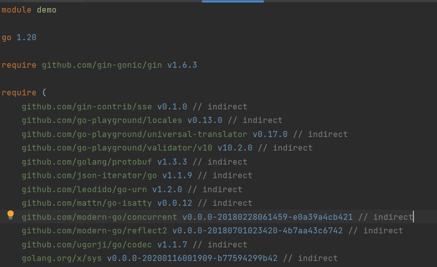

# Go的项目管理

## GOROOT

安装Go的路径，防止了Go的内置库，如"fmt"

## GOPATH

与GOMODULE对立，起先是帮助开发者管理项目的工具。但是现在通常使用GOMODULE管理项目。	

GO的目录结构为

- src：存放项目代码的地方
- pkg：编译后的库文件
- bin：存放编译生成的二进制文件

如果使用完整的GOPATH管理项目，那么一个完整的项目路径应该为

```
my-go                 // my-go为GOPATH目录
  -- bin
     -- myApp1        // 编译生成
     -- myApp2        // 编译生成
     -- myApp3        // 编译生成
  -- pkg                             依赖包编译后的*.a文件//
  -- src
     -- MyApp1        // 项目1
        -- models
        -- controllers
        -- others
        -- main.go 
     -- MyApp2        // 项目2
        -- models
        -- controllers
        -- others
        -- main.go
```

或者每一个项目单独配置一个GOPATH，不适用全局的GOPATH

```
my-go                 // my-go为GOPATH目录
  -- bin
     -- myApp1        // 编译生成
     -- myApp2        // 编译生成
     -- myApp3        // 编译生成
  -- pkg                             依赖包编译后的*.a文件//
  -- src
     -- MyApp1        // 项目1
        -- models
        -- controllers
        -- others
        -- main.go 
my-goT                 // my-goT为GOPATH目录
  -- bin
     -- myApp1        // 编译生成
     -- myApp2        // 编译生成
     -- myApp3        // 编译生成
  -- pkg                             依赖包编译后的*.a文件//
  -- src
     -- MyApp2        // 项目2
        -- models
        -- controllers
        -- others
        -- main.go 
```

GOPATH管理项目的模式被废弃，通常采用GOMODULE管理项目

## GOMODULE

为了解决GOPATH的不足（比如在上面的案例中，第三方库的版本只能存在一个），产生了GOMODULE。也可以理解为这个是Go版本的Maven。

### go.mod

在Go Module管理的项目中必须存在的一个文件。



- module path：一般采用仓库名+module name的方式定义。
  - module github.com/panicthis/modfile

- go version：go的版本号
- require：该项目依赖库
- exclude：跳过某个依赖的库

### go mod 指令

- go mod download：下载模块到本地缓存，缓存的路径为 $GOPATH/pkg/mod/cache
- go mod init：初始化go.mod
- go mod tidy：更新依赖文件
- go mod vendor：依赖转移至本地的vendor文件
- go mod edit：手动打印依赖文件
- go mod graph：打印依赖图
- go mod verify：校验依赖

### go env

- GOROOT：安装GO的路径，配置了内置库
- GOPROXY：go env -w GOPROXY=https://goproxy.cn,direct，设置代理
- GOPATH：存放第三方库文件路径
- GO111MODULE：是否使用go module管理，on、off、auto，以后一直设置on即可
- GOCACHE：存放编译后文件的地方

### go.sum

为了确保一致性构建，Go引入了go.mod文件来标记每个依赖包的版本，在构建过程中go命令会下载go.mod中的依赖包，下载的依赖包会缓存在本地，以便下次构建。 考虑到下载的依赖包有可能是被黑客恶意篡改的，以及缓存在本地的依赖包也有被篡改的可能，单单一个go.mod文件并不能保证一致性构建。

为了解决Go module的这一安全隐患，Go开发团队在引入go.mod的同时也引入了go.sum文件，用于记录每个依赖包的哈希值，在构建时，如果本地的依赖包hash值与go.sum文件中记录得不一致，则会拒绝构建。